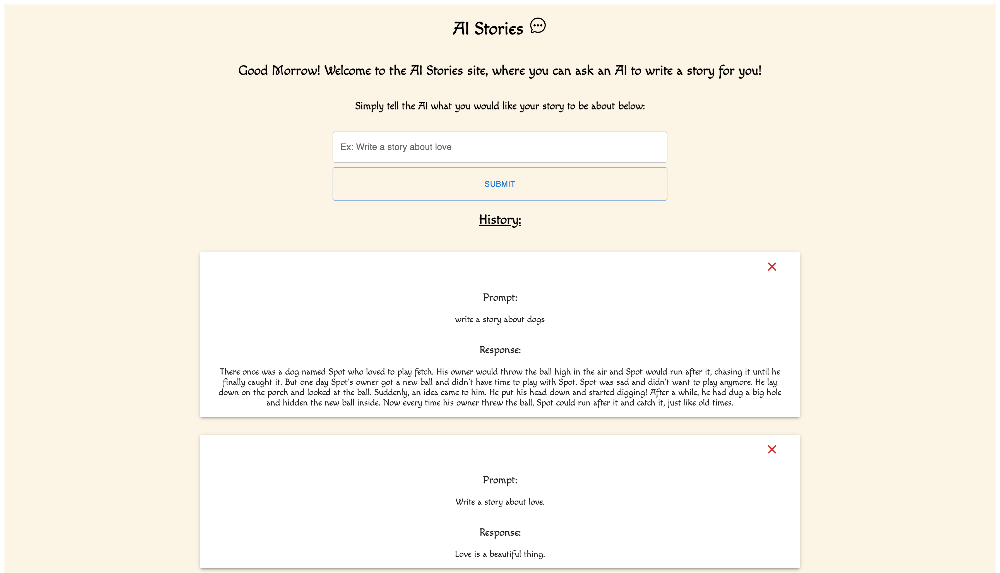
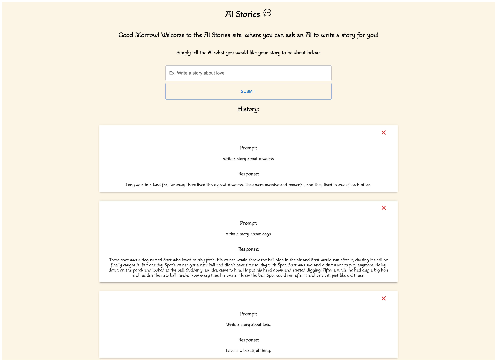

# AI-Stories

<a name="descsection"></a>

## Description

An app that sends plain text prompts to the OpenAI API and displays the results in a list. This is for Shopify's Fall 2022 Internship Challenge.

[](https://opensource.org/licenses/MIT)

## Table of Contents

1. [ Description ](#descsection)
2. [ User Story ](#usersection)
3. [ Acceptance Criteria ](#acceptancesection)
4. [ Installation ](#installsection)
5. [ License ](#licensesection)
6. [ Contributing ](#contribsection)
7. [ Collaborators ](#collabsection)
8. [ Screenshots ](#picsection)
9. [ Links ](#linksection)

<a name="usersection"></a>

## User Story:

```
AS A user,
I WANT a site where I can enter simple text
SO THAT I can enjoy results from OpenAI
```

<a name="acceptancesection"></a>

## Acceptance Criteria:

```
Given an unauthenticated user
WHEN I arrive at the website
THEN I am presented with a page welcoming me to AI-Stories
WHEN I click inside the form
THEN I am able to input text prompting the AI what story I want it to write
WHEN I click the Submit button
THEN the text I typed is completed into an AI response below the form in the history section.
WHEN I scroll through the history section
THEN I am able to see the prompts and responses from my machine sorted newest to oldest
```

<a name="installsection"></a>

## Installation:

- Clone the repository using:

```
git clone https://github.com/emthedm/ai-stories.git
```

- Ensure you are in the current working directory
- Install dependencies by opening the terminal (ctrl + j on windows) and running:

```
npm install || npm i
```

- Run the project by typing the following in your integrated terminal:

```
npm run start
```

<a name="licensesection"></a>

## License:

MIT License

Copyright (c) 2022 Eric Martin

Permission is hereby granted, free of charge, to any person obtaining a copy
of this software and associated documentation files (the "Software"), to deal
in the Software without restriction, including without limitation the rights
to use, copy, modify, merge, publish, distribute, sublicense, and/or sell
copies of the Software, and to permit persons to whom the Software is
furnished to do so, subject to the following conditions:

The above copyright notice and this permission notice shall be included in all
copies or substantial portions of the Software.

THE SOFTWARE IS PROVIDED "AS IS", WITHOUT WARRANTY OF ANY KIND, EXPRESS OR
IMPLIED, INCLUDING BUT NOT LIMITED TO THE WARRANTIES OF MERCHANTABILITY,
FITNESS FOR A PARTICULAR PURPOSE AND NONINFRINGEMENT. IN NO EVENT SHALL THE
AUTHORS OR COPYRIGHT HOLDERS BE LIABLE FOR ANY CLAIM, DAMAGES OR OTHER
LIABILITY, WHETHER IN AN ACTION OF CONTRACT, TORT OR OTHERWISE, ARISING FROM,
OUT OF OR IN CONNECTION WITH THE SOFTWARE OR THE USE OR OTHER DEALINGS IN THE
SOFTWARE.

<a name="contribsection"></a>

## Contributing:

1. [Fork the repo!](https://docs.github.com/en/get-started/quickstart/fork-a-repo)
2. Create a feature branch:

```
git checkout -b yourname-branch
```

3. Commit changes:

```
git commit -m 'Your changes here'
```

4. Push to the branch:

```
git push origin yourname-branch
```

5. Submit a pull request and wait for it to be approved or denied.

<a name="collabsection"></a>

## Collaborators:

- Eric Martin: <a href="https://github.com/EMtheDM" target="_blank" alt="Github Page"></a>

<a name="picsection"></a>

## Screenshots:




<a name="linksection"></a>

## Links:

Deployed Site: https://ai-stories.netlify.app/

Github Site: https://github.com/emthedm/ai-stories
